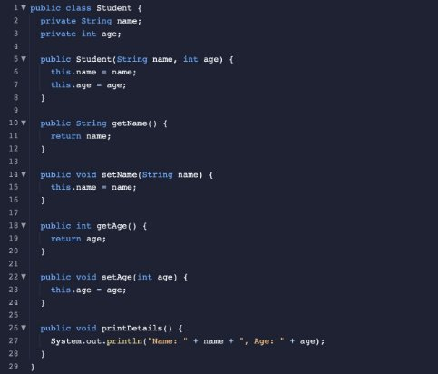

<!-- Output copied to clipboard! -->

<!-----

You have some errors, warnings, or alerts. If you are using reckless mode, turn it off to see inline alerts.
* ERRORs: 0
* WARNINGs: 0
* ALERTS: 3

Conversion time: 1.056 seconds.

Using this Markdown file:

1. Paste this output into your source file.
2. See the notes and action items below regarding this conversion run.
3. Check the rendered output (headings, lists, code blocks, tables) for proper
   formatting and use a linkchecker before you publish this page.

Conversion notes:

* Docs to Markdown version 1.0β34
* Sun Dec 18 2022 20:03:59 GMT-0800 (PST)
* Source doc: AP CS Doc
* This document has images: check for >>>>>  gd2md-html alert:  inline image link in generated source and store images to your server. NOTE: Images in exported zip file from Google Docs may not appear in  the same order as they do in your doc. Please check the images!

----->

>>>>>  gd2md-html alert:  ERRORs: 0; WARNINGs: 0; ALERTS: 3.

<ul style="color: red; font-weight: bold"><li>See top comment block for details on ERRORs and WARNINGs. <li>In the converted Markdown or HTML, search for inline alerts that start with >>>>>  gd2md-html alert:  for specific instances that need correction.</ul>

Links to alert messages:
<a href="#gdcalert1">alert1</a>
<a href="#gdcalert2">alert2</a>
<a href="#gdcalert3">alert3</a>

>>>>> PLEASE check and correct alert issues and delete this message and the inline alerts.

**Introduction to Classes and Objects in Java**

A class in Java serves as a model or blueprint for building objects. It specifies the data and behavior (methods) of the objects derived from the class. Objects, with their own collection of data (known as instance variables) and methods, represent a particular instance of a class.

**Defining a Class**

In Java, the class keyword is used in conjunction with the class name to define a class. The following components should be part of the class definition:

1. Instance variables: These are variables that depict the data or state of an object. They are also known as fields or attributes.
2. Constructors: These unique methods are employed in the creation and initialization of objects. They have identical names to the class and lack a return type.
3. Methods: These are functions that define the behavior of an object. They may accept arguments and have a return type. 

Here is an example of a straightforward Java class definition:

>>>>>  gd2md-html alert: inline image link here (to images/image1.png). Store image on your image server and adjust path/filename/extension if necessary.  (<a href="#">Back to top</a>)(<a href="#gdcalert2">Next alert</a>) >>>>> 

Name and age are two attributes that belong to the Student class. The two arguments it accepts in its constructor, are used to initialize the instance variables. Four additional methods exist: getName(), setName(), getAge(), and setAge(). Because you can use these methods to access (get) or modify (set) the value of the instance variables, they are known as accessor and mutator methods. The Student object's information is printed using the printDetails() method.

**Creating Objects**

Using the new keyword, the class name, and the constructor with the necessary arguments, we can create an object from a class. An example of how to create an object of the Student class is provided below:

>>>>>  gd2md-html alert: inline image link here (to images/image2.png). Store image on your image server and adjust path/filename/extension if necessary.  (<a href="#">Back to top</a>)(<a href="#gdcalert3">Next alert</a>) >>>>> 

This generates an object of the Student class named "John" who is 20 years old. Then, you can access, change, or perform actions on the object's data using its methods. For instance:

>>>>>  gd2md-html alert: inline image link here (to images/image3.png). Store image on your image server and adjust path/filename/extension if necessary.  (<a href="#">Back to top</a>)(<a href="#gdcalert4">Next alert</a>) >>>>> 

**Conclusion**

In this overview, we covered Java classes and objects. We learned how to define classes by using instance variables and constructors. We also learned how to create objects as instances of these classes. By using methods including accessors and mutators, we can read and change the data of objects as well as perform other actions.	

**Blackjack Game Outline**

1. Go to the file Card.java
    1. Create the constructor for a card with a suit and a value
    2. Create the Card.getSuit() method which returns the suit of the card
    3. Create the Card.getSuit() method which returns the value of the card
2. Go to the file Deck.java
    4. Create the constructor for a deck of 52 cards
        1. Create an empty ArrayList of cards
        2. Create a String array with the four suits
        3. Create a String array with the thirteen values
        4. Use a nested for loop to add all possible cards to the empty ArrayList
    5. Complete the Deck.shuffle() method by adding code similar to the code in the constructor to create a new Deck of 52 cards
    6. Create the Deck.deal() method which uses the ArrayList.remove() method to remove a card from the deck and return the removed card
3. Go to the file Hand.java
    7. Create the constructor for an empty hand
    8. Create the Hand.addCard(Card card) method which uses the ArrayList.add() method to add a given card to the hand
    9. Create the Hand.getCards() method which returns the list of cards in the hand
    10. Complete the Hand.getTotalValue() method which loops through each card in the Hand to calculate the total value
        5. If a card is an ace, increment the total and ace variables by 1
        6. If a card is a face card, increment the total by 10
        7. If a card is not an ace or a face card, increment the total variable by the number on the card using the Integer.parseInt() method
        8. For each ace in the hand, increment the total by 10 repeatedly as long as the total does not go over 21
4. Go to the file Game.java
    11. Create the constructor for a blackjack game which creates a new deck and empty hands for the player and dealer
    12. Complete the Game.play() method which plays a game of blackjack
        9. Shuffle the deck and deal two cards to each player
        10. Code the events of the player’s turn, which displays the hands of both players (only the first card of the dealer), prompts the player to choose an action, and acts accordingly
        11. Code the events of the dealer’s turn, which deals a card to the dealer if they don’t have at least 17 points
        12. Complete the conditional to print messages for the outcome of the game
5. Go to the file Main.java
    13. In the infinite loop, create a new Game object and call the Game.play() method
    14. At the end of the loop, ask the player if they want to play again, breaking out of the loop if they want to stop
